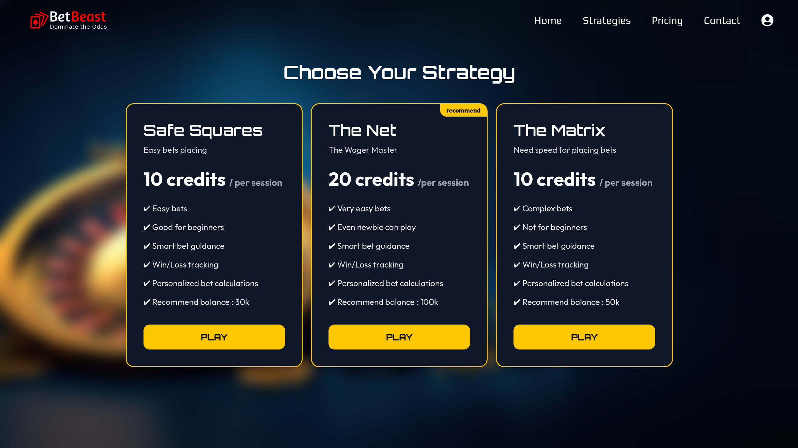
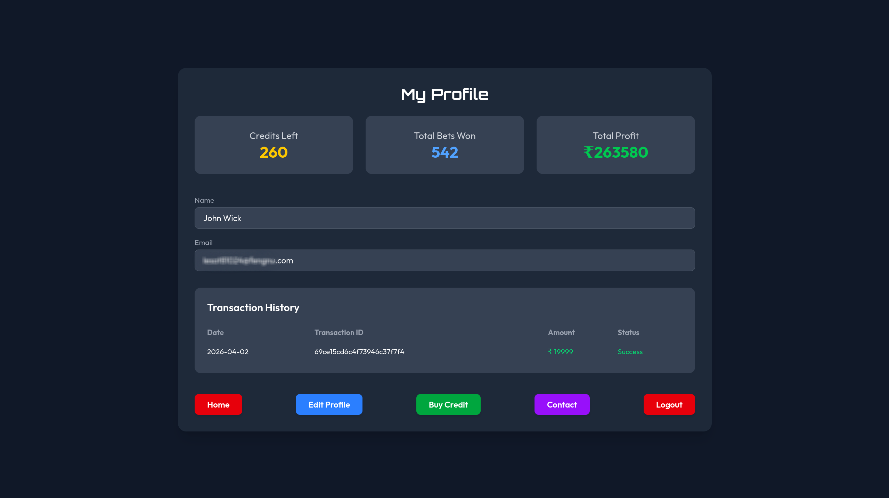
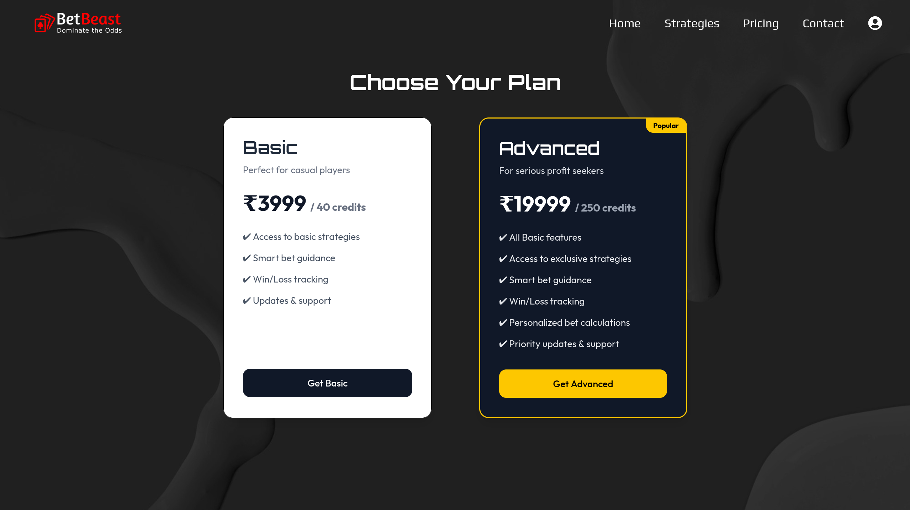

# BetBeast – Advanced Roulette Strategy Web App

BetBeast is a professional-grade, full-stack web application designed to help users explore and utilize original roulette strategies. Built on the MERN stack (MongoDB, Express, React, Node.js), the platform combines intuitive interfaces, secure authentication, and seamless payment management to provide a complete roulette simulation and strategy tracking experience.

---

## **Features**

- **Original Roulette Strategies**  
  Users can access three unique strategies: SafeSquares, TheNet, and TheMatrix. Each strategy provides dynamic betting guidance based on user inputs without exposing underlying algorithms.

- **Win/Loss & Profit Tracking**  
  Automatic tracking of bets, wins, and profits, updating user profiles in real-time.

- **Credit Management**  
  Strategies require credits to use. Users can purchase credits securely via Razorpay, with automated tracking and history.

- **User Authentication & Profile Management**
  - Email verification via OTP
  - Secure login and registration
  - Profile updates and credit balance monitoring

- **Responsive Frontend**  
  Built with React and TailwindCSS for a seamless, responsive experience across devices.

- **Secure Backend**  
  Node.js + Express server with JWT authentication, MongoDB data storage, and robust route protection.

---

## **Tech Stack**

- **Frontend:** React, TailwindCSS, React Router, Axios, React Toastify
- **Backend:** Node.js, Express, JWT Authentication, Razorpay Integration
- **Database:** MongoDB, Mongoose
- **Deployment:** Vercel (frontend), any Node.js-compatible hosting (backend)

---

## **Getting Started**

### **Prerequisites**

- Node.js v18+
- MongoDB database instance
- Razorpay account for payments

### **Installation**

1. Clone the repository:

   ```bash
   git clone https://github.com/VikramDhull/BetBeast
   cd betbeast

   ```

2. Install dependencies for frontend and backend:

#### Frontend :

```bash
cd client
npm install
```

#### Backend :

```bash
cd ../server
npm install
```

3. Create .env file in the backend directory with the following keys:

```bash
 MONGO_URI=<Your MongoDB URI>
 JWT_SECRET=<Your JWT Secret>
 RAZORPAY_KEY_ID=<Razorpay Key ID>
 RAZORPAY_KEY_SECRET=<Razorpay Key Secret>
 CURRENCY=INR
 FRONTEND_URL=<Your Frontend URL>
```

4. Start the development servers:

### Backend

```bash
npm run start
```

### Frontend

```bash
cd ../client
npm run dev
```

## Usage :

1. Register/Login – Sign up using your email and verify via OTP.
2. Purchase Credits – Add credits securely through Razorpay to use strategies.
3. Use Strategies – Input roulette spin results and follow guidance for SafeSquares, TheNet, or TheMatrix.
4. Track Performance – View win/loss, total bets won, and profits on your profile.

## Screenshots :

### Home Page


### Strategy Page



### Profile Dashboard



### Pricing Dashboard



## Future Enhancements

1. Real-time roulette simulation with automated spin input
2. Advanced analytics dashboard for betting patterns
3. Additional original strategies

## License

This project is for educational and personal use. Proprietary strategy algorithms are confidential and protected.

## Contact

Developed by **Vikram Dhull**  
For inquiries, reach out via imvikramdhull@gmail.com
